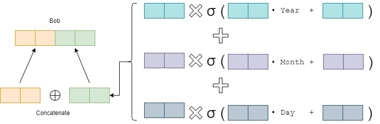
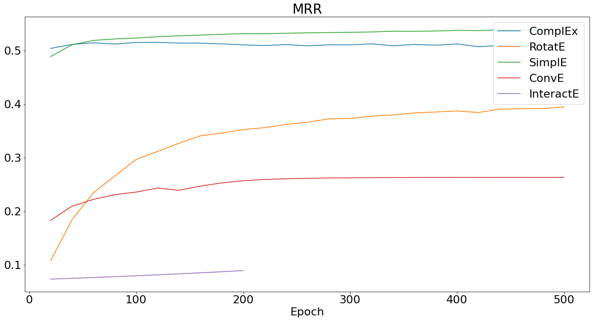
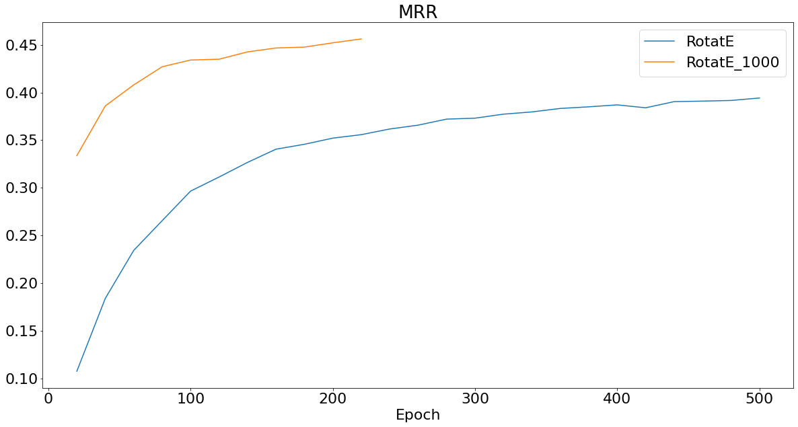
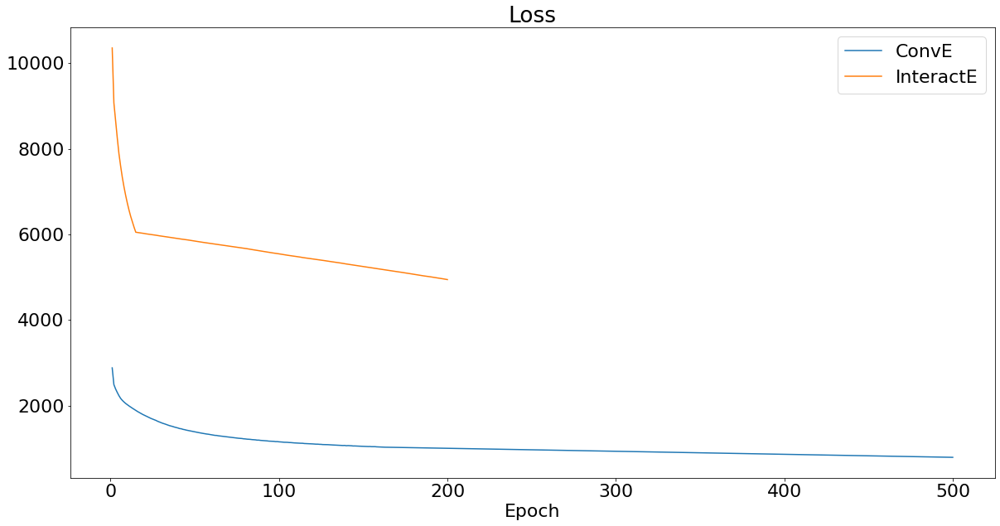

# Augmenting Various Static Embedding with Diachronic Embedding for TemporalKnowledge Graph Completion
Final project of CS6216 Advanced Topics in Machine Learning course

This repository is an extension of the [original repository](https://github.com/BorealisAI/de-simple) for the reprsentation proposed in [Diachronic Embedding for Temporal Knowledge Graph Completion](https://arxiv.org/pdf/1907.03143.pdf) paper.

## Diachronic Embedding
The entity  embeddings  is  a  function  of  the  entity  feature & the timestamp
Combines the static vector representation from any kind  of  static  knowledge  graph  embedding  method,  with time-specific  vector  representation




## Results
Test results on ICEWS14 is as follows. Due to resource limitations, InteractE was run only for 200 epochs.

| Model | MRR | Hit@1 | Hit@3 | Hit@10 |
| --- | --- | --- | --- | --- |
| DE_SimplE | 0.5248 | 0.4151 | 0.5914 | 0.7286 |
| DE_ComplEx | 0.5022 | 0.3879 | 0.5713 | 0.7197 |
| DE_RotatE | 0.3917 | 0.2986 | 0.4417 | 0.5665 |
| DE_ConvE | 0.2454 | 0.1472 | 0.2591 | 0.449 |
| DE_InteractE | 0.0083 | 0.0306 | 0.078 | 0.1402 |

From the result, we can see that DE_SimplE is still the highest and DE_RotatE, DE_ConvE, and DE_InteractE are unexpectedly have low performance.

Validation results over training are as follows.



As seen, ComplEx seems to perform well on earlier epochs but its performance decreases over time, which may be a sign of overfitting. Meanwhile, RotatE, ConvE, and InteractE doesn't seem to work as well as expected.



RotatE doesn't seem to only work well with high embedding dimensions and with self-supervised training.



ConvE and InteractE does not converge yet after training (500 epochs for ConvE and 200 epochs for InteractE), so the test results may not be good. This may be due to the training method not performing well for models with large number of parameters.

## ICEWS14 - Filtered Test Set

Risk of leakage of test set as described in [ConvE](https://www.aaai.org/ocs/index.php/AAAI/AAAI18/paper/viewFile/17366/15884) paper can happen. Thus, we provide two additional test set files filtering out the inverse-relation-leaked triples from ICEWS14 test set, one classifying inverse relations without considering temporal information and one considering strictly relation in combination with temporal informations.

Results on those sets are as follows. As before, InteractE was trained only to 200 epochs.

| Model | ICEWS14 - Filtered w/ Timestamp |  |  |  | ICEWS14 - Filtered w/o Timestamp |  |  |  |
| --- | --- | --- | --- | --- | --- | --- | --- | --- |
|  | MRR | Hit@1 | Hit@3 | Hit@10 | MRR | Hit@1 | Hit@3 | Hit@10 |
| DE_SimplE | 0.517 | 0.4071 | 0.5831 | 0.7209 | 0.5092 | 0.3878 | 0.575 | 0.7465 |
| DE_ComplEx | 0.4958 | 0.3823 | 0.5639 | 0.7118 | 0.4853 | 0.3735 | 0.5514 | 0.698 |
| DE_ConvE | 0.2414 | 0.1435 | 0.2567 | 0.4381 | 0.2327 | 0.1401 | 0.2532 | 0.4221 |
| DE_InteractE | 0.0081 | 0.0299 | 0.0733 | 0.1375 | 0.0079 | 0.0292 | 0.0701 | 0.1331 |

## Installation
- Create a conda environment:
```
$ conda create -n tkgc python=3.6 anaconda
```
- Run
```
$ conda activate tkgc
$ conda install pytorch==1.1.0 torchvision==0.3.0 cudatoolkit=10.0 -c pytorch
```

## How to use?
After installing the requirements, run the following command to reproduce results for DE-SimplE:
```
$ python main.py -dropout 0.4 -se_prop 0.68 -model DE_SimplE
```
To reproduce the results for DE_ComplEx, DE_RotatE, DE_ConvE and DE-InteractE, specify **model** as following.
```
$ python main.py -dropout 0.4 -se_prop 0.68 -model DE_ComplEx
```
## Citation
If you use the codes, please cite the following paper:
```
@inproceedings{goel2020diachronic,
  title={Diachronic Embedding for Temporal Knowledge Graph Completion},
  author={Goel, Rishab and Kazemi, Seyed Mehran and Brubaker, Marcus and Poupart, Pascal},
  booktitle={AAAI},
  year={2020}
}
```
## License
Copyright (c) 2018-present, Royal Bank of Canada.
All rights reserved.
This source code is licensed under the license found in the
LICENSE file in the root directory of this source tree.
